# FieldSolo mobile accessibility and responsive implementation plan

## Goal

Bring FieldSolo's Expo mobile app to a legible, responsive baseline on iOS and Android while preserving its current visual identity. The implementation target is:

- WCAG AA contrast for normal text (4.5:1) and UI components/text where applicable.
- Comfortable 44 pt touch targets for interactive controls.
- Usable layouts at iOS accessibility text sizes and Android 200% font scale.
- Stable layouts at 320, 360, 390, and 440 pt portrait widths (app is portrait-locked; landscape is out of scope).

The audit found systemic token and layout problems, so fix the foundations first rather than patching individual screens.

## Evidence gallery

### Default-size flows

| Authentication | Jobs | Job detail and sheet |
| --- | --- | --- |
| 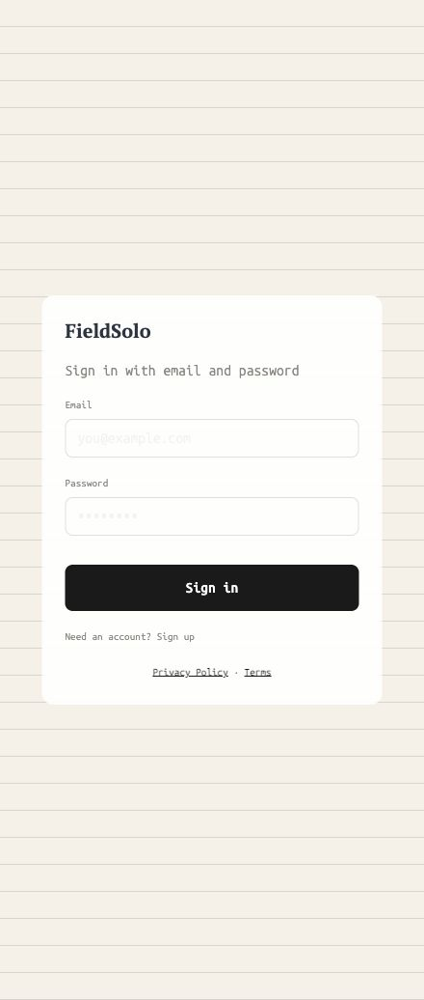 | 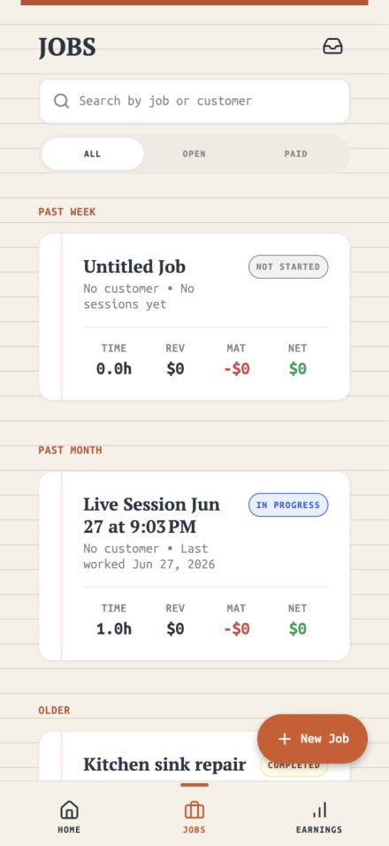 | 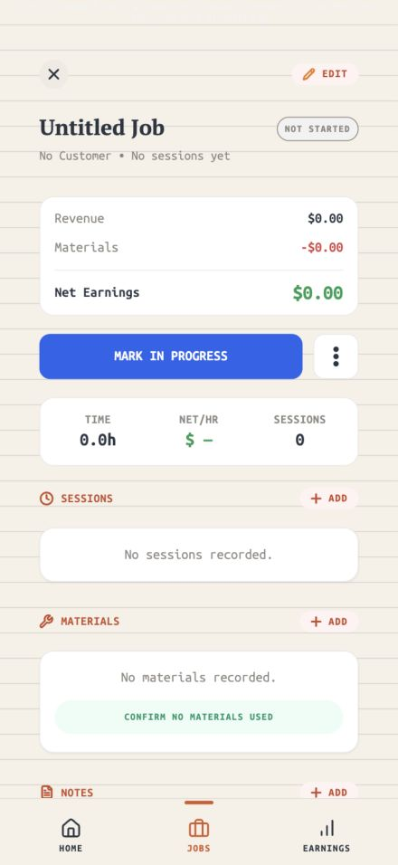 |

| Edit Job sheet | Earnings | Privacy |
| --- | --- | --- |
| 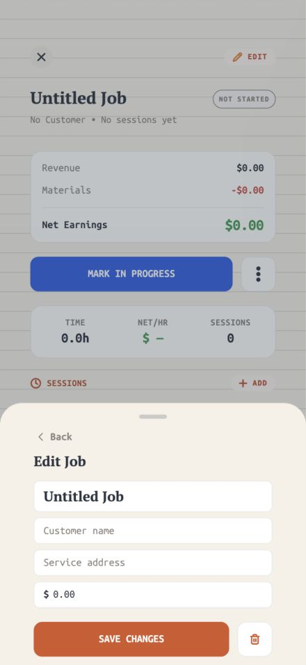 | 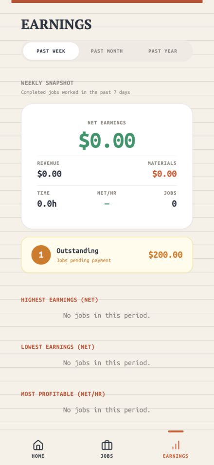 | 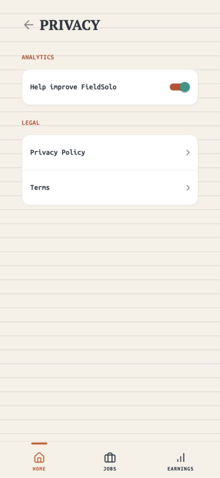 |

| Quick Capture | iPhone 17 Pro Max native Home |
| --- | --- |
| 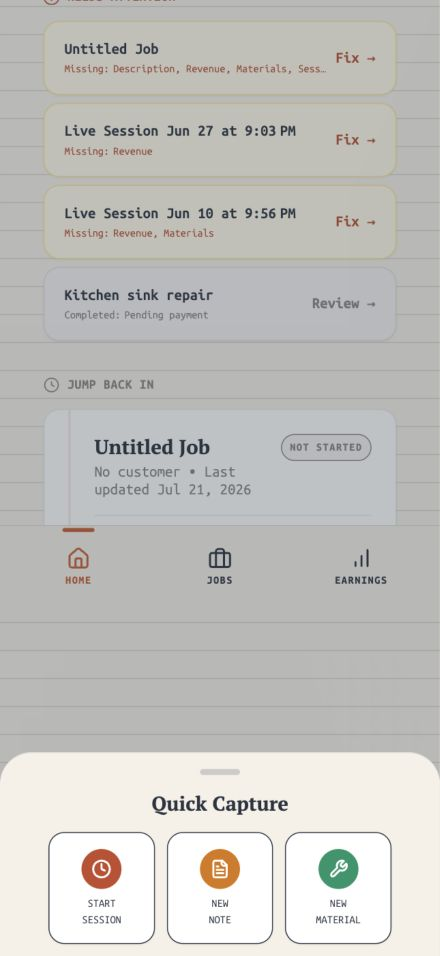 | 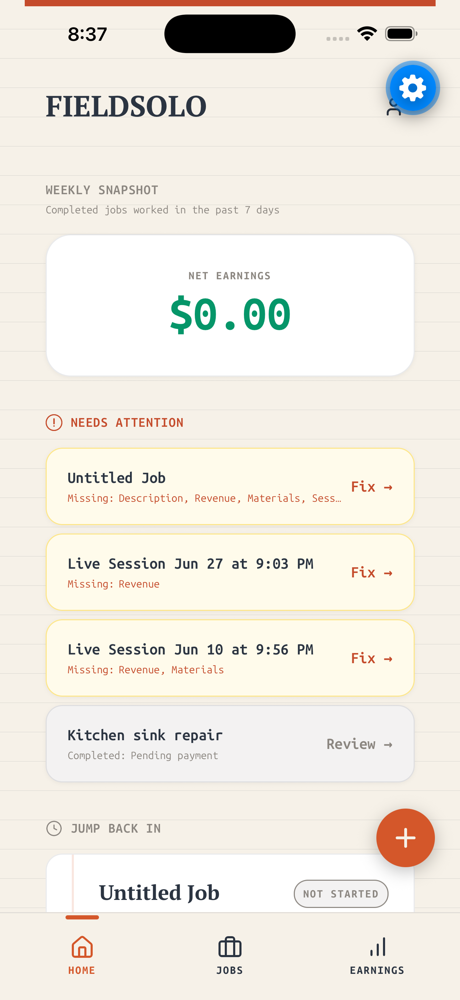 |

### Responsive and text-scaling failures

| 320 pt width: no card gutter and FAB overlap | Historical — landscape (out of scope) |
| --- | --- |
| 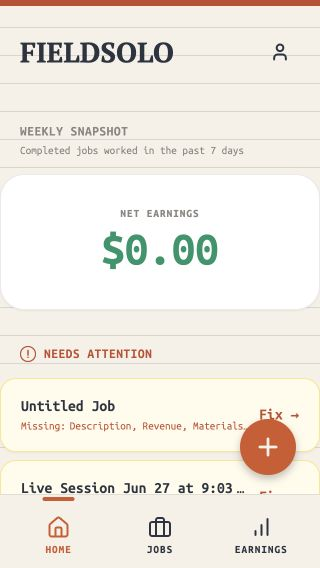 | 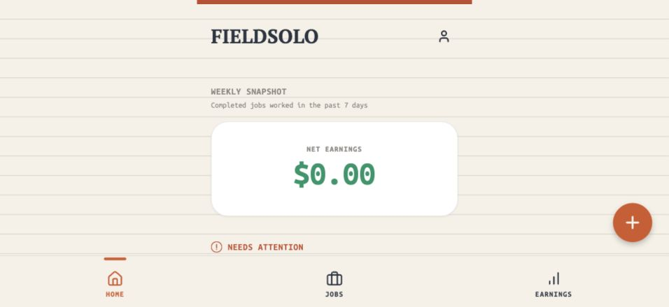 |

| iOS accessibility Dynamic Type | Android 200% font scale |
| --- | --- |
| 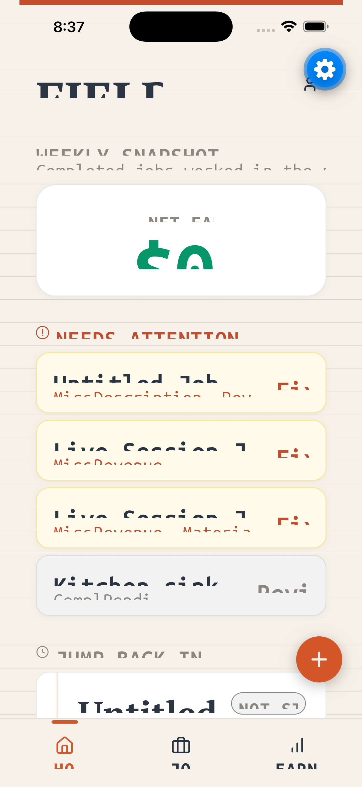 | 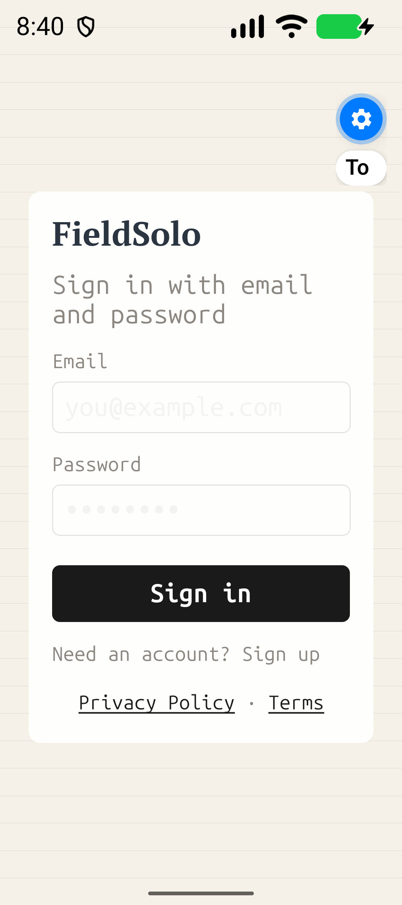 |

The blue gear in native screenshots is the simulator accessibility overlay, not FieldSolo UI.

## Findings and implementation priorities

### P0 — Dynamic Type and font-scale reflow

**Observed:** iOS accessibility sizing and Android 200% scaling clip headings, metrics, card content, button labels, and bottom-navigation labels. This is a release blocker for the agreed target.

**Root causes:** fixed heights, very small token sizes, narrow fixed-width columns, and heavy `numberOfLines` use.

**Status:** Implemented. Shared `dynamicTypeTextStyle` scales line boxes with OS font scale; critical content no longer uses `numberOfLines={1}` (retained only for single-token Quick Capture tiles and the metric snapshot currency value with `adjustsFontSizeToFit`). `maxFontSizeMultiplier` / layout `maxScale` caps removed so OS Dynamic Type is not suppressed. Bottom nav labels wrap and reserved height tracks full font scale.

**Implement:**

1. Keep React Native font scaling enabled; do not add `allowFontScaling={false}` or `maxFontSizeMultiplier` caps.
2. Replace fixed control/card heights containing text with `minHeight`, padding, and natural vertical expansion.
3. Remove `numberOfLines={1}` from job names, important status/missing-information text, form labels, empty states, sheet choices, and CTA labels. Retain truncation only for genuinely decorative or redundant text.
4. Let tab labels, CTAs, cards, and bottom-sheet rows wrap or grow vertically. Keep icon-only controls accessible with an explicit label.
5. Use `flexShrink: 1`, `minWidth: 0`, and wrapping deliberately; do not solve overflow by shrinking text below the type scale.
6. Add native regression tests at standard, 135%, and 200% scale before closing this work.

### P0 — Responsive content geometry and FAB placement

**Observed:** `CONTENT_MAX_WIDTH = 353`, `TOP_HEADER_MAX_WIDTH = 393`, and the bottom-sheet `maxWidth = 343` produce 43.5 pt margins on a 440 pt iPhone 17 Pro Max, near-zero gutters at 320–360 pt, and large empty space in landscape. The FAB covers job content on compact screens.

**Status:** Implemented via `useContentColumn` / `contentColumnMetrics` (16 pt gutter under 360 pt width, 20 pt at 360+, column cap ~600–640). Legacy `CONTENT_MAX_WIDTH` / `TOP_HEADER_MAX_WIDTH` exports removed from mobile `nativeTokens`. FAB uses content-column right inset + scroll bottom clearance. Landscape remains out of scope (portrait-locked).

**Primary sources:**

- `apps/mobile-expo/src/theme/nativeTokens.ts`
- `apps/mobile-expo/src/theme/useContentColumn.ts`
- `apps/mobile-expo/src/components/ds/BottomSheetShell.tsx`
- Home, Jobs, Earnings, Inbox, Job Detail, Sign In, Profile, Help, Privacy, and design-system cards.

**Implement one shared layout primitive:**

- Phone content: `width: '100%'` with a 16 pt gutter at 320–359 pt and a 20 pt gutter at 360 pt and above.
- Cards: fill that content column; do not cap individual phone cards at 353 pt.
- Wide portrait / large phones: center one responsive column capped around 600–640 pt. Do not use the phone card cap as the large-screen cap.
- Headers should use the same responsive column, with only intentional full-bleed accents outside it.
- Bottom sheets should fill available phone width minus the shared gutter; use the larger cap only on wide portrait layouts.
- Position the FAB inside the safe-area-aware content boundary and reserve enough bottom/right padding in scroll content so it never overlaps a row action or text.
- Replace runtime `Dimensions.get('window')` layout decisions in `BottomSheetShell` and `LiveSessionOverlay` with `useWindowDimensions` where resize/orientation matters.

### P1 — Contrast and semantic-color repair

**Observed token failures:**

| Pair | Measured contrast | Result |
| --- | ---: | --- |
| Secondary `#8B8680` on common surfaces | 3.04–3.61:1 | Fails normal text |
| Accent `#C44B2B` on warm canvas | 4.25:1 | Fails normal text |
| Brand primary `#D4572A` on warm canvas | 3.59:1 | Fails normal text |
| Muted text on action orange | 2.57:1 | Fails |
| Success, warning, neutral status text | 3.58 / 3.07 / 3.23:1 | Fail normal text |
| Financial positive / negative on white | 3.49 / 4.38:1 | Fail normal text |
| Primary text on default canvas | 11.68:1 | Passes |

**Status:** Implemented. Tokens repaired in `packages/design-system/tokens/colors.json` (secondary `#6F6A65`, darkened brand/accent/status/financial). Automated coverage in `packages/design-system/lib/contrast.test.ts`. Main empty/help copy on CanvasWarm uses primary where it is the primary message.

**Implement:**

1. Repair colors centrally in `packages/design-system/tokens/colors.json`; do not create local, one-off screen overrides.
2. Darken the secondary text token to at least 4.5:1 on all default, warm, white, and subtle surfaces. `#6F6A65` is a viable starting point (minimum measured ratio: 4.51:1), but verify final tokens after any visual tuning.
3. Rework semantic foreground/background pairs together. If a brand background cannot support 4.5:1 normal text with its current foreground, darken the background, use a darker foreground, or increase the text role to truly large text; do not rely on a near-miss ratio.
4. Apply the repaired tokens to helper copy, labels, empty states, status pills, financial values, legal/destructive messaging, sheet subtitles, and disabled-but-readable text.
5. Add an automated contrast check for every token pair used as text-on-background.

### P1 — Type scale and information hierarchy

**Observed:** body is 14 pt, most supporting copy and labels are 10 pt, and `SessionAddToSessionTiles` uses 8.5 pt. The app has a 28 pt screen H1 but little hierarchy between it and dense metadata.

**Status:** Implemented in `typography.json` / mobile `createTextStyles` (Display-H1 32, Title-H3 20, Body 16, Body-Bold 18, labels/pills ≥12). 8.5 pt tile labels removed.

**Implement these minimum roles in `packages/design-system/tokens/typography.json`:**

| Role | Target | Use |
| --- | ---: | --- |
| Screen title | 30–32 pt | Home, Jobs, Earnings, Profile, Help, Privacy |
| Section heading | 20–24 pt | Major content groups and sheet titles |
| Card/job title | 17–18 pt, semibold | Job rows and key action cards |
| Body | 16 pt | Explanatory and interactive copy |
| Secondary body | 14–16 pt | Customer, date, subtitle, empty-state copy |
| Label / tab / status | 12–14 pt | Tabs, status pills, section labels, metric labels |

Keep the current serif screen-title and mono utility style, but give each role enough size, line height, and contrast to be read in bright field conditions. Remove the 8.5 pt tile label and avoid 10 pt as a general-purpose text role.

### P1 — Touch targets and form controls

**Observed:** tabs are 36 pt, several inputs are 38 pt, and several controls are 40 pt. Those are below the 44 pt product target even where WCAG minimum target-size exceptions may apply.

**Status:** Implemented for primary interactive chrome (tabs, inputs, icon buttons, ADD/EDIT, Profile/Inbox header buttons). Noninteractive status pills may remain compact.

**Implement:**

- Standard interactive rows, inputs, tabs, buttons, and icon buttons: minimum 44×44 pt hit area.
- Preserve visual compactness with internal padding or invisible hit slop where appropriate, but never depend on a 36–40 pt visible control for frequent field use.
- Use `minHeight: 44` for form controls and tabs, and allow taller height at increased text scale.
- Review compact status/action pills individually: noninteractive display pills may remain compact; interactive pills need a 44 pt target.

### P2 — Semantics, status, and content clarity

**Status:** Code complete (see `docs/accessibility-audit/verify-p2/`). Remaining: complete VoiceOver / TalkBack walkthrough on each matrix cell before release sign-off.

**Implement:**

1. Mark every visible screen title as an accessibility heading. Keep section headers as lower-level headings rather than making section navigation outrank the screen title.
2. Give icon-only controls concise `accessibilityLabel` values and expose their current state where relevant.
3. Ensure status is communicated with text and not color alone; preserve the existing useful textual status labels.
4. Verify sheet focus order, modal isolation, keyboard dismissal, and announcement of error/success states with VoiceOver and TalkBack.
5. Correct the sign-up screen instruction so it describes sign-up rather than sign-in.

## Screen/component execution checklist

- [x] Auth: Sign In, Sign Up, validation/error, password entry, legal links.
- [x] Home: Weekly snapshot, needs-attention cards, jump-back cards, FAB, native bottom navigation.
- [x] Jobs: search, All/Open/Paid tabs, list cards, empty state, status pills, New Job action.
- [x] Job Detail: summary, CTA row, session/material/note sections, activity cards, edit action.
- [x] Bottom sheets: shell, edit job, session/material/note flows, chooser lists, profile/password/delete-account, consent/legal reacceptance, live-session controls.
- [x] Inbox: Notes and Materials tabs, empty/loading/error states.
- [x] Earnings: range tabs, snapshot, outstanding-payment card, ranked states, zero-data states.
- [x] Profile, Help, Privacy: action rows, analytics toggle, legal links, support content.
- [x] Shared design-system cards: responsive column migration (legacy 353 pt phone caps removed from mobile tokens), dense labels, financial/status values.

**Release gate still open:** full VoiceOver + TalkBack pass on the native matrix (`docs/accessibility-audit/verify-p2/MATRIX-RESULTS.md`).

## Verification and acceptance criteria

### Automated

- Add a token contrast test covering every foreground/background pair used by text and icons.
- Add component tests for the shared responsive container, card width behavior, FAB clearance, and no unintended single-line truncation for critical content.
- Run the existing mobile test suite, typecheck, and an iOS/Android export after the implementation.

### Native visual matrix

Test on actual/native simulators rather than web alone:

| Platform | Sizes / settings |
| --- | --- |
| iOS | iPhone 17 Pro Max at default and accessibility Dynamic Type; compact iPhone width; VoiceOver |
| Android | Pixel-class device at 100%, 135%, and 200% font scale; compact width; TalkBack |

For each screen/component checklist item, verify:

- No clipped or overlapping text.
- No CTA, FAB, sheet, or navigation overlap.
- At least 16 pt phone gutters at compact widths.
- Full-width cards inside the responsive content column.
- 44 pt interactive targets.
- All normal text meets 4.5:1 contrast.
- VoiceOver/TalkBack reads screen title first, then controls in visual order.
- Keyboard-open sheets still expose the active field and save/cancel actions.

## Implementation sequence

1. Create responsive container, safe FAB positioning, and dynamic-height primitives.
2. Update design-system color and typography tokens; add token tests.
3. Migrate shared cards, navigation, tabs, form controls, and bottom-sheet shell.
4. Migrate screens in this order: Auth → Home → Jobs → Job Detail → Inbox → Earnings → Profile/Help/Privacy.
5. Remove/rework critical truncation and fixed heights as each component is migrated.
6. Run the full native validation matrix, then address remaining screen-specific issues.
7. Update the maintained product artifact and design exports after the implementation is approved and shipped.

## Scope guardrails

- Preserve FieldSolo's existing warm-paper visual language, serif display titles, mono utility text, and status vocabulary.
- Treat this as an accessibility and responsiveness upgrade, not a visual redesign.
- Do not suppress OS text scaling to make screenshots look tidy.
- Keep the evidence images redacted; do not add profile or destructive-account screenshots that show personal data.
